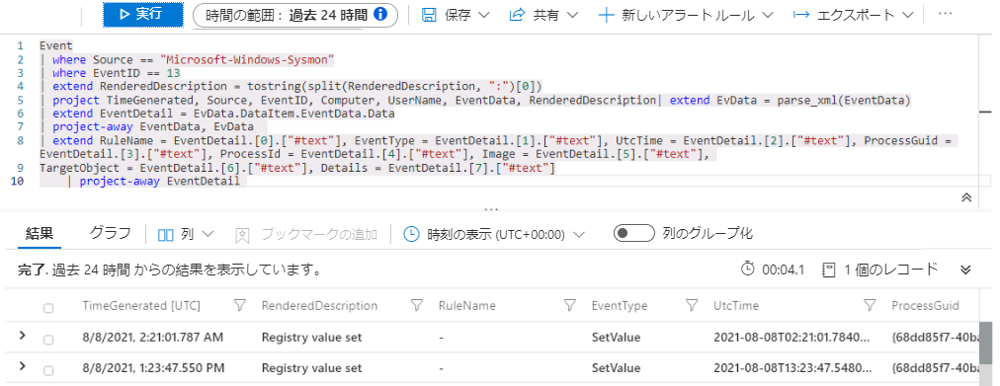
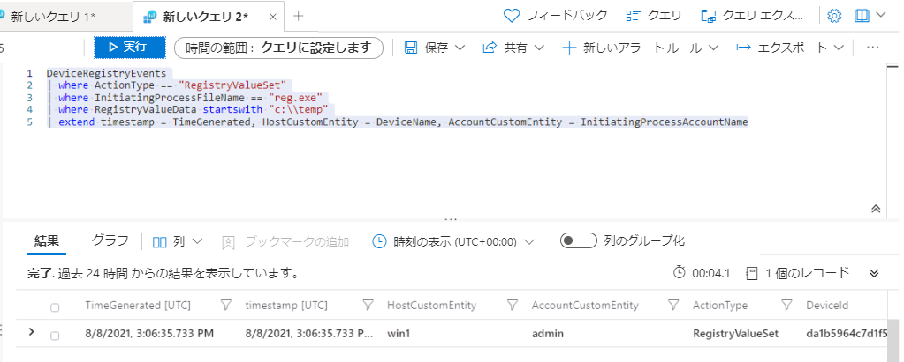
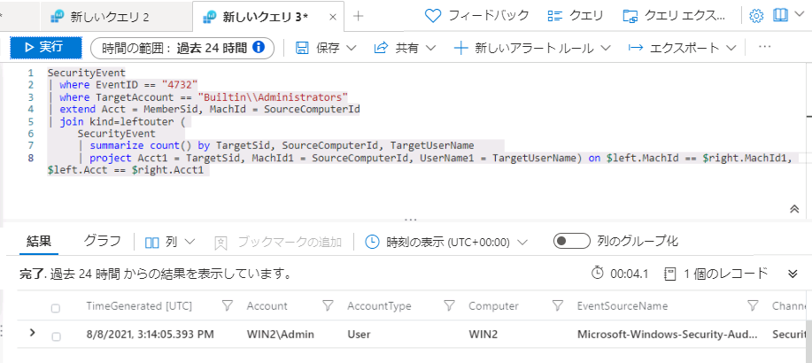

# モジュール 7 - ラボ 1 - 演習 6 - 検出を作成する

### タスク 1: Sysmon による攻撃1の検出

このタスクでは、セキュリティイベントコネクタと Sysmon がインストールされているホストで攻撃 1 の検出を作成します。

この攻撃は、起動時に実行されるレジストリ キーを作成しています。
```Command
REG ADD "HKCU\SOFTWARE\Microsoft\Windows\CurrentVersion\Run" /V "SOC Test" /t REG_SZ /F /D "C:\temp\startup.bat"
```

1. 管理者として WIN1 仮想マシンにログインします。パスワードは **Pa55w.rd** です。  

2. Edge ブラウザーで Azure ポータルに移動します https://portal.azure.com

3. **サインイン**ダイアログボックスで、ラボのホスティングプロバイダーから提供された管理者用の**テナント電子メール**アカウントをコピーして貼り付け、**次へ**を選択します。

4. **パスワードの入力**ダイアログ ボックスで、ラボ ホスティング プロバイダーから提供された管理者用の**テナントパスワード** をコピーして貼り付け、**サインイン**を選択します。

5. Azure ポータルの検索バーに 「*Sentinel*」 と入力し、「**Azure Sentinel**」 を選択します。

6. 先ほど作成した Azure Sentinel ワークスペースを選択します。

7. 全般セクションから **Logs** を選択します。

8. まず、データが保存されている場所を確認する必要があります。攻撃を行ったばかりなので  ログの時間範囲を**過去 24 時間**に設定します。

9. 次の KQL ステートメントを実行します

```KQL
search "temp\\startup.bat"
```

10. 結果は、3つの異なるテーブルについて示しています。
    - DeviceProcessEvents
    - DeviceRegistryEvents
    - Event

    *デバイス* テーブルは、Defender for Endpoint (データコネクタ - Microsoft 365 Defender) からのものです。  *イベント*は、データ コネクタのセキュリティ イベントからのものです。 

    Sysmon と Defender for Endpoint の 2 つの異なるソースからデータを受信しているため、後で結合できる 2 つの KQL ステートメントを作成する必要があります。  最初の調査では、それぞれを個別に確認していきます。

    **注:** まれに、データの読み込みプロセスの読み込みに通常よりも時間がかかる場合があります。  その場合、テーブルがクエリに数時間表示されないことがあります。

11. 最初のデータソースは、Windows ホストからの Sysmon です。  以下の KQL ステートメントを実行します。

```KQL
search in (Event) "temp\\startup.bat"
```
結果は、イベントテーブルに対してのみ表示されるようになりました。  

12. 行を展開して、レコードに関連するすべての列を表示します。  EventData や ParameterXml などのいくつかのフィールドには、構造化データとして保存された複数のデータ項目があります。  これにより、特定のフィールドでのクエリが困難になります。  

13. 次に、各行のデータを解析するKQLステートメントを作成して、意味のあるフィールドを作成する必要があります。  GitHubのAzureSentinelコミュニティでは、ParsersフォルダーにParsersの例が多数あります。  ブラウザーで新しいタブを開き、以下に移動します **https://github.com/Azure/Azure-Sentinel**

14. **Parsers**フォルダーを選択し、次に **Sysmon** フォルダーを選択します。  以下のものが見えるはずです。<br><br>  Parsers/Sysmon/Sysmon-v12.0.txt

15. Sysmon-v12.0.txt ファイルを選択し内容を確認します。

ファイルの先頭に、Event テーブルをクエリし、EventData という名前の変数に格納する Let ステートメントが表示されます。


```KQL
let EventData = Event
| where Source == "Microsoft-Windows-Sysmon"
| extend RenderedDescription = tostring(split(RenderedDescription, ":")[0])
| project TimeGenerated, Source, EventID, Computer, UserName, EventData, RenderedDescription
| extend EvData = parse_xml(EventData)
| extend EventDetail = EvData.DataItem.EventData.Data
| project-away EventData, EvData  ;
```

ファイルのさらに下に、EventID == 13 を調べ、EventData 変数を入力として使用している別の let ステートメントがあります。  

```KQL
let SYSMON_REG_SETVALUE_13=()
{
    let processEvents = EventData
    | where EventID == 13
    | extend RuleName = EventDetail.[0].["#text"], EventType = EventDetail.[1].["#text"], UtcTime = EventDetail.[2].["#text"], ProcessGuid = EventDetail.[3].["#text"], 
    ProcessId = EventDetail.[4].["#text"], Image = EventDetail.[5].["#text"], TargetObject = EventDetail.[6].["#text"], Details = EventDetail.[7].["#text"]
    | project-away EventDetail  ;
    processEvents;
    
};
```
これは良いサンプルのように見えます。

16. 上記のステートメントを再利用します。Sentinel で **ログ** を開き、以下のような KQL ステートメントを作成します。これはすべてのレジストリキーセット値の行を表示します。次の KQL クエリを実行します。

```KQL

Event
| where Source == "Microsoft-Windows-Sysmon"
| where EventID == 13
| extend RenderedDescription = tostring(split(RenderedDescription, ":")[0])
| project TimeGenerated, Source, EventID, Computer, UserName, EventData, RenderedDescription
| extend EvData = parse_xml(EventData)
| extend EventDetail = EvData.DataItem.EventData.Data
| project-away EventData, EvData  
| extend RuleName = EventDetail.[0].["#text"], EventType = EventDetail.[1].["#text"], UtcTime = EventDetail.[2].["#text"], ProcessGuid = EventDetail.[3].["#text"], 
    ProcessId = EventDetail.[4].["#text"], Image = EventDetail.[5].["#text"], TargetObject = EventDetail.[6].["#text"], Details = EventDetail.[7].["#text"]
    | project-away EventDetail 


```

   

17.  このステートメントを再利用できるようにするために、 「ログ」ウィンドウで、「**保存**」、「**関数として保存**」の順に選択します。次のように入力して関数を保存します。

関数名: Event_Reg_SetValue
従来のカテゴリ: Sysmon


18. 「＋」をクリックして新しい 「ログ クエリ」 タブを開きます。そして、以下の KQL ステートメントを実行します:

```KQL

Event_Reg_SetValue

```
すでにあるデータによっては、多くの行を受け取る可能性があります。  これは予想されていることです。  次のタスクは、特定のシナリオにフィルターをかけることです

19. 以下の KQL ステートメントを実行します:

```KQL

Event_Reg_SetValue | search "startup.bat"

```
これにより、特定のレコードが返され、データを確認して、行を識別するために何を変更できるかを確認できます

20. 脅威インテリジェンスから、脅威アクターが reg.exe を使用してレジストリキーを追加していることがわかります。  ディレクトリは c:\temp. です。startup.bat は別の名前にすることができます。次のスクリプトを実行します。

```KQL
Event_Reg_SetValue 
| where Image contains "reg.exe"

```
次に、c:\temp ディレクトリの結果のみを返す必要があります。

21. 続いて、以下の KQL ステートメントを実行します:

```KQL
Event_Reg_SetValue 
| where Image contains "reg.exe"
| where Details startswith "C:\\TEMP"
```

これは良い検出ルールのように見えます。  

22. アラートについてできるだけ多くのコンテキストを提供することにより、セキュリティ運用アナリストを支援することが重要です。これには、調査グラフで使用するエンティティの投影が含まれます。  次のクエリを実行します。

```KQL
Event_Reg_SetValue 
| where Image contains "reg.exe"
| where Details startswith "C:\\TEMP"
| extend timestamp = TimeGenerated, HostCustomEntity = Computer, AccountCustomEntity = UserName

```

23. 適切な検出ルールができたので、クエリのあるログウィンドウで、コマンド バーの **「新しいアラート ルール」** を選択し、**「Azure Sentinel アラートの作成」** を選択します。

24. これにより、アナリティクスルールウィザードが起動します。  全般タブに次のように入力します

    氏名: Sysmon Startup RegKey

    説明: Sysmon Startup Regkey in c:\temp

    方針: Persistemce

    重大度: 高

「**次へ: ルール ロジックの設定 >**」を選択します。

25. 「**ルール ロジックの設定**」 タブで、**ルール クエリ**が既に入力されているはずです。 

26. クエリスケジューリングの場合、次のように設定します。

- クエリの実行間隔: 5 分
- 次の時間分の過去データを参照します：  1 日

**注** 同じデータに対して意図的に多くのインシデントを生成しています。  これにより、ラボはこれらのアラートを使用できるようになります。

27. 残りのオプションは既定値のままにします。  「**次へ: インシデント設定 >**」ボタンを選択します。

28. インシデント設定には、以下を設定します 

- インシデントの設定： 有効
- アラート グループ： 無効

「**次へ: 自動応答 >**」ボタンを選択します。

29. 自動応答タブで次のように設定します。

- *PostMessageTeams-OnAlert* を選択します。

「**次へ: レビュー**」ボタンを選択します。

30. レビュータブで、**作成**を選択します。


### タスク 2: エンドポイントの Defender による攻撃1の検出

このタスクでは、Microsoft Defender for Endpoint が構成されたホストで攻撃1の検出を作成します。

この攻撃により、起動時に実行されるレジストリキーが作成されています。  
```Command
REG ADD "HKCU\SOFTWARE\Microsoft\Windows\CurrentVersion\Run" /V "SOC Test" /t REG_SZ /F /D "C:\temp\startup.bat"
```

1. Azure Sentinel ポータルで、全般セクションから**ログ**を選択します。

2. まず、データが保存されている場所を確認する必要があります。攻撃を行ったばかりなので  

    ログの時間範囲を過去 24 時間に設定します。

3. 以下の KQL ステートメントを実行します:

```KQL
search "temp\\startup.bat"
```

4. 結果は、3つの異なるテーブルについて示しています。
    DeviceProcessEvents
    DeviceRegistryEvents
    Event

    Device* テーブルは、Defender for Endpoint （データコネクタ-Microsoft 365 Defender） からのものです。  Event、データコネクタのセキュリティイベントからのものです。 

    Sysmon と Defender for Endpoint の 2 つの異なるソースからデータを受信しているため、  後で結合できる 2 つの KQL ステートメントを作成する必要があります。  しかし、最初の調査では、それぞれを個別に確認していきます。

5. この検出は、Defender for Endpoint からのデータに焦点を当てます。  以下の KQL ステートメントを実行します:

```KQL
search in (Device*) "temp\\startup.bat"
```

6. テーブル - DeviceRegistryEvents は、データがすでに正規化されており、クエリが簡単にできるように見えます。  行を展開して、レコードに関連するすべての列を表示します。

7. 脅威インテリジェンスから、脅威アクターが reg.exe を使用してレジストリキーを追加していることがわかります。  ディレクトリは c:\temp です。startup.bat は別の名前にすることができます。  この KQL ステートメントを入力します。

```KQL

DeviceRegistryEvents
| where ActionType == "RegistryValueSet"
| where InitiatingProcessFileName == "reg.exe"
| where RegistryValueData startswith "c:\\temp"


```

これは良い検出ルールのように見えます。  

8. アラートについてできるだけ多くのコンテキストを提供することにより、セキュリティオペレーションセンターアナリストを支援することが重要です。これには、調査グラフで使用するエンティティの投影が含まれます。次のクエリを実行します。

```KQL
DeviceRegistryEvents
| where ActionType == "RegistryValueSet"
| where InitiatingProcessFileName == "reg.exe"
| where RegistryValueData startswith "c:\\temp"
| extend timestamp = TimeGenerated, HostCustomEntity = DeviceName, AccountCustomEntity = InitiatingProcessAccountName


```

   

9.  適切な検出ルールができたので、クエリのあるログ ウィンドウで、コマンド バーの **「新しいアラート ルール」** を選択します。  次に、**「Azure Sentinel アラートの作成」** を選択します。

10. これにより、アナリティクスルールウィザードが起動します。  全般タブに次のように入力します


    氏名: D4E Startup RegKey

    説明: D4E Startup Regkey in c:\temp

    方針: Persistence

    重大度: 高

11. 「**次へ: ルール ロジックを設定　>**」ボタンを選択します。

12. 「ルール ロジックの設定」 タブで、**ルール クエリ**が既に入力されているはずです。

13. クエリスケジューリングの場合、次のように設定します。

- クエリの実行間隔:  5 分
- 次の時間分の過去データを参照します：  1 日

**注** 同じデータに対して意図的に多くのインシデントを生成しています。  これにより、ラボはこれらのアラートを使用できるようになります。

14. 残りのオプションは既定値のままにします。  「**次へ: インシデントの設定 >**」を選択します。

15. インシデント設定には、以下を設定します 

- インシデントの設定： 有効
- アラート グループ： 無効

「**次へ: 自動応答 >**」を選択します。

16. 自動応答タブで次のように設定します。

- PostMessageTeams-OnAlert を選択します。
- 「**次へ: レビュー**」 をクリックします。

17. 確認および作成 タブで、**作成** を選択します。

### タスク 3: SecurityEvent による攻撃2の検出

このタスクでは、セキュリティイベントコネクタと Sysmon がインストールされているホストで攻撃2の検出を作成します。

この攻撃により、新しいユーザーが作成され、そのユーザーがローカル管理者に追加されています。
```Command
net user theusernametoadd /add
net user theusernametoadd ThePassword1!
net localgroup administrators theusernametoadd /add
```

1. Azure Sentinel メニューの 全般 セクションで**ログ**を選択します。

2. まず、データが保存されている場所を確認する必要があります。攻撃を行ったばかりなので  

    ログの時間範囲を過去 24 時間に設定します。

3. 以下の　KQL　ステートメントを実行します:

```KQL
search "administrators"
```

4. 結果は次の表を示します。
    Event
    SecurityEvent

5. 最初のデータソースは SecurityEvent です。特権グループへのメンバーの追加を識別するために Windows が使用するイベント ID を調査するときが来ました。  次の EventID と Event は、私たちが探しているものです。    

4732 - A member was added to a security-enabled local group.

次のスクリプトを実行しています。

```KQL
SecurityEvent
| where EventID == "4732"
| where TargetAccount == "Builtin\\Administrators"

```

6. 行を展開して、レコードに関連するすべての列を表示します。  探しているユーザー名は表示されません。  問題は、ユーザー名を保存する代わりに、セキュリティ識別子 （SID） が保存されるということです。  次のKQLは、SIDを照合して、Administrators グループに追加された TargetUserName にデータを入力しようとします。


```KQL
SecurityEvent
| where EventID == "4732"
| where TargetAccount == "Builtin\\Administrators"
| extend Acct = MemberSid, MachId = SourceComputerId 
| join kind=leftouter (
     SecurityEvent 
     | summarize count() by TargetSid, SourceComputerId, TargetUserName
     | project Acct1 = TargetSid, MachId1 = SourceComputerId, UserName1 = TargetUserName
) on $left.MachId == $right.MachId1, $left.Acct == $right.Acct1 

```
これは良い検出ルールのように見えます。  

   

**注:** ラボで使用されるデータセットが小さいため、この KQL は期待される結果を返さない場合があります。

7. アラートについてできるだけ多くのコンテキストを提供することにより、セキュリティ運用アナリストを支援することが重要です。これには、調査グラフで使用するエンティティの投影が含まれます。  次のクエリを実行します。


```KQL
SecurityEvent
| where EventID == "4732"
| where TargetAccount == "Builtin\\Administrators"
| extend Acct = MemberSid, MachId = SourceComputerId 
| join kind=leftouter (
     SecurityEvent 
     | summarize count() by TargetSid, SourceComputerId, TargetUserName
     | project Acct1 = TargetSid, MachId1 = SourceComputerId, UserName1 = TargetUserName
) on $left.MachId == $right.MachId1, $left.Acct == $right.Acct1 
| extend timestamp = TimeGenerated, HostCustomEntity = Computer, AccountCustomEntity = UserName1

```

8. 適切な検出ルールができたので、クエリのあるログ ウィンドウで、コマンド バーの **「新しいアラート ルール」** を選択し、**「Azure Sentinel アラートの作成」** を選択します。

9. これにより、アナリティクスルールウィザードが起動します。  全般タブに次のように入力します

- 名前: SecurityEvents Local Administrators User Add 
- 説明: SecurityEvents Local Administrators User Add 
- 方針: Privilege Escalation
- 重大度: 高

「**次へ: ルール ロジックを設定　>**」ボタンを選択します。

10. ルールロジックの設定タブで、ルールクエリエンティティとマップエンティティが既に入力されている必要があります。

11. クエリスケジューリングの場合、次のように設定します。

- クエリの実行間隔: 5 分
- 次の時間分の過去データを参照します：  1 日

**注** 同じデータに対して意図的に多くのインシデントを生成しています。  これにより、ラボはこれらのアラートを使用できるようになります。

12. 残りのオプションは既定値のままにします。  「**次へ: インシデントの設定 >**」を選択します。

13. インシデント設定には、以下を設定します 

- インシデントの設定： 有効
- アラート グループ： 無効
- 「**次へ: 自動応答 >」を選択します。**

14. 自動応答タブで次のように設定します。

- **PostMessageTeams-OnAlert** を選択します。
- 「**次へ: 確認 >**」ボタンを選択します。

15. レビュー タブで、**作成**を選択します。

## 演習 7 に進みます。
