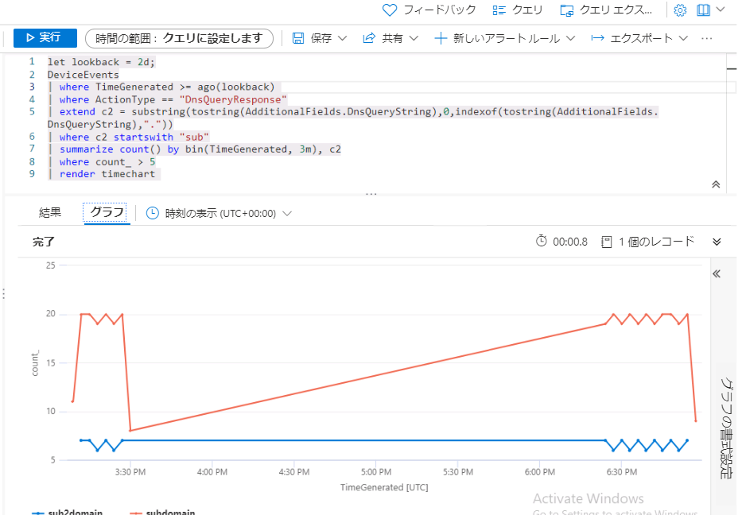
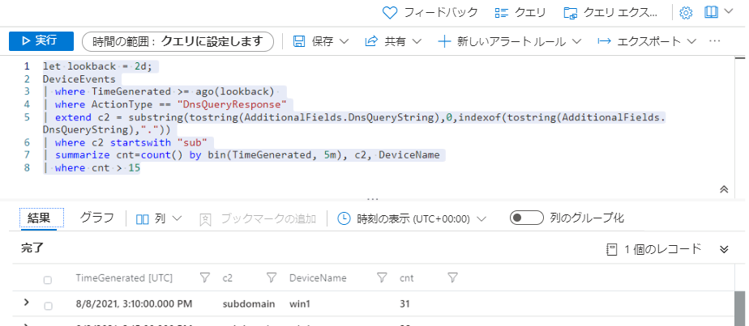

# モジュール 8 - ラボ 1 - 演習 1 - AzureSentinel で脅威ハンティングを実行する

## ラボ シナリオ

あなたは Azure Sentinel を実装した企業で働いているセキュリティ オペレーションアナリストです。あなたはコマンドと制御 (C2) テクニックについて脅威インテリジェンスを受け取りました。  その脅威に対して捜索とウォッチを実行する必要があります。

**注：** このラボで使用するログデータは、コースの前のモジュールで作成したものです。  

**注：** 前のモジュールでデータを探索するプロセスをすでに経験しているため、ラボでは開始するための KQL ステートメントを提供しています。  

### タスク 1: ハンティングクエリの作成

このタスクでは、捜索クエリを作成し、結果をブックマークして、ライブストリームを作成します。

1. 管理者として WIN1 仮想マシンにログインします。パスワードは **Pa55w.rd**。  

2. Edge　ブラウザーで Azure portal (https://portal.azure.com) に移動します。

3. **サインイン** ダイアログ ボックスで、ラボ ホスティング プロバイダーから提供された**テナントの電子メール**アカウントをコピーして貼り付け、「**次へ**」を選択します。

4. **パスワードの入力**ダイアログ ボックスで、ラボ ホスティング プロバイダーから提供された**テナントパスワード**をコピーして貼り付け、**「サインイン」** を選択します。

5. Azure ポータルの検索バーに「*Sentinel*」と入力し、「**Azure Sentinel**」を選択します。

6. Azure Sentinel ワークスペースを選択します。

7. 「**ログ**」を選択する。 

8. 新規クエリ1のスペースに以下の KQL ステートメントを入力します。

```KQL
let lookback = 2d;
DeviceEvents
| where TimeGenerated >= ago(lookback) 
| where ActionType == "DnsQueryResponse"
| extend c2 = substring(tostring(AdditionalFields.DnsQueryString),0,indexof(tostring(AdditionalFields.DnsQueryString),"."))
| where c2 startswith "sub"
| summarize count() by bin(TimeGenerated, 3m), c2
| where count_ > 5
| render timechart 
```

   

9. このステートメントの目的は、C2 が一貫してビーコンを出しているかどうかを確認するための視覚化を提供することです。  3m の設定を 30 秒以上に調整してください。  count_ > 5 の設定を他のスレッショルドカウントに変更して、影響を確認します。

10. これで、C2サーバにビーコン送信されている DNS リクエストが特定できました。  次に、どのデバイスがビーコンになっているかを確認します。  次の KQL ステートメントを入力します。

```KQL
let lookback = 2d;
DeviceEvents
| where TimeGenerated >= ago(lookback) 
| where ActionType == "DnsQueryResponse"
| extend c2 = substring(tostring(AdditionalFields.DnsQueryString),0,indexof(tostring(AdditionalFields.DnsQueryString),"."))
| where c2 startswith "sub"
| summarize cnt=count() by bin(TimeGenerated, 5m), c2, DeviceName
| where cnt > 15
```
   

**注：** 生成されるログデータは、1 つのデバイスからのみです。

11. Azure Sentinel ポータルの 脅威管理領域で「**捜索**」ページを選択します。

12. コマンド バーで「**+ 新しいクリエ**」を選択します。

13. **カスタム クエリ**には、次の KQL ステートメントを入力します。

```KQL
let lookback = 2d;
DeviceEvents
| where TimeGenerated >= ago(lookback) 
| where ActionType == "DnsQueryResponse"
| extend c2 = substring(tostring(AdditionalFields.DnsQueryString),0,indexof(tostring(AdditionalFields.DnsQueryString),"."))
| where c2 startswith "sub"
| summarize cnt=count() by bin(TimeGenerated, 5m), c2, DeviceName
| where cnt > 15
```

14. 名前には「*C2 Hunt*」と入力します。

15. エンティティマッピングには：

    ホストには「**デバイス名**」を選択し、「**追加**」を選択します。
    タイムスタンプで「**TimeGenerated**」を選択し、「**追加**」を選択します

16. 「**作成**」を選択します。

17. AzureSentinel では、 | リストの　*C2 Hunt*　で、先ほど作成したクエリをハンティングブレード検索します。

18. リストの中から「**C2 Hunt**」を選択します。

19.  画面の右側の「**クリエの実行**」ボタンを選択します。

20. 結果のカウントは、フライアウトの上部に表示されます。

21. 「**結果の表示**」ボタンを選択します。

22. 結果の最初の行を選択します。 

23. 「**ブックマークの追加**」ボタンを選択します。

24. 「ブックマークの追加」フライアウトで、表示されるペインで「**作成**」を選択します。

25. Azure Sentinel portal の捜索ページに戻ります (ヒント: 左にスクロールします)。

26. 「**ブックマーク**」タブを選択します。

27. 結果一覧で作成したブックマークを選択します。

28. フライアウト ペインで、「**調査**」ボタンを選択します。

29. グラフを調査する

30. Azure portal の捜索ページに戻ります。

31. 「**クリエ**」タブを選択します

32. 「**C2 Hunt**」クエリを選択します。

33. 行の最後にある **「...」** を選択して、コンテキストメニューを開きます。

34. 「**ライブストリームに追加**」を選択します。

# 演習 2 に進みます。
